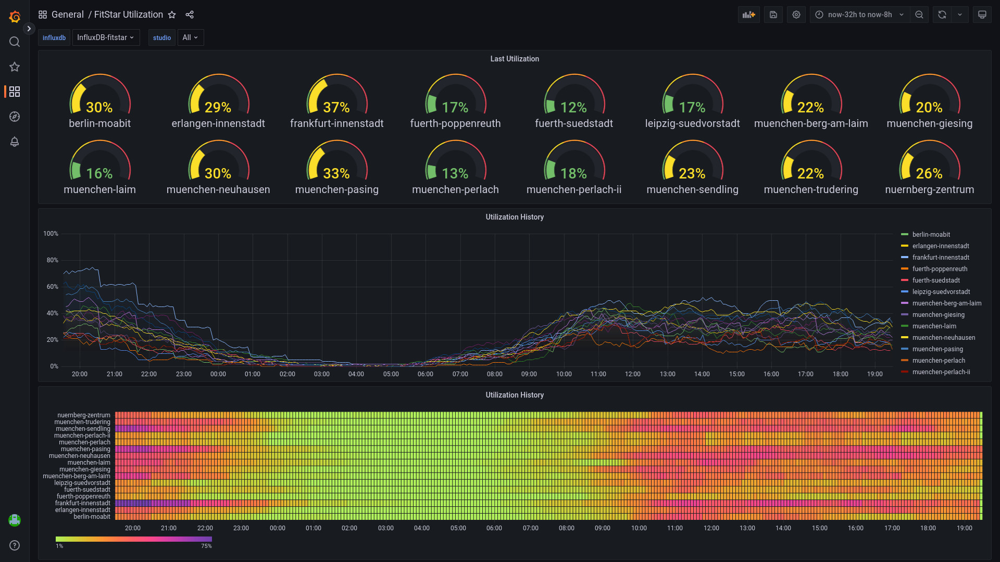

# Fit Star Utilization

Python script for pulling utilization data from the
[Fit Star website](https://www.fit-star.de), paired with
[Grafana](https://grafana.com/)
dashboard for visualization.



## Demo
Instead of setting this up yourself, you can also simply access
an instance of the dashboard I host myself
[here](https://grafana-public.schollheim.net/d/qq0XN2SVk/fitstar-utilization).
I also intend make the
[InfluxDB](https://www.influxdata.com/)
that feeds this publicly accessible when I find the time.

## Python Script
The script uses [Selenium](https://www.selenium.dev/)
to automatically retrieve the utilization data from the Fit Star studio
websites (e.g. https://www.fit-star.de/fitnessstudio/muenchen-neuhausen).
This has certain implications for its dependencies and usage.

### Dependencies
Selenium requires a compatible browser together with the corresponding driver.
A good choice is [Chromium](https://www.chromium.org),
which can be installed with the driver by:
```bash
sudo apt install -y chromium chromium-driver
```
The required Python modules are listed in the
[`requirements.txt`](requirements.txt)
file. To install them execute:
```bash
sudo python3 -m pip install -r requirements.txt
```

### Usage
To fetch the data for all studios in Munich and insert them into a given
[InfluxDB](https://www.influxdata.com/) the script is used as follows:
```bash
./fitstar-utilization.py --host influxdb.example.net --port 8086 --ssl --verify-ssl --username admin --password supersecretpassword --filter muenchen
```
For further information refer to the `-h/--help` option.

Note that because of Selenium requiring a browser, the script needs to run in
the presence of the graphical session. In case you run this over SSH or as
cron job, you need to set the `DISPLAY` variable. You can use the `w` command
to list active X sessions.

I myself run the script on a
[Raspberry Pi 4 Model B](https://www.raspberrypi.com/products/raspberry-pi-4-model-b/)
in an [XRDP](http://xrdp.org/) session.

## Grafana Dashboard
The Grafana dashboard can be directly imported into Grafana with its
ID `17200`, the corresponding webpage is:
https://grafana.com/grafana/dashboards/17200

## License
This project is distributed under [MIT](LICENSE) license.
